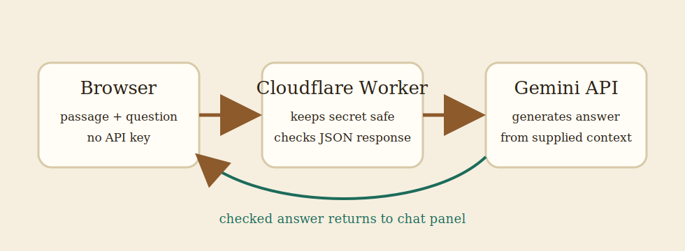
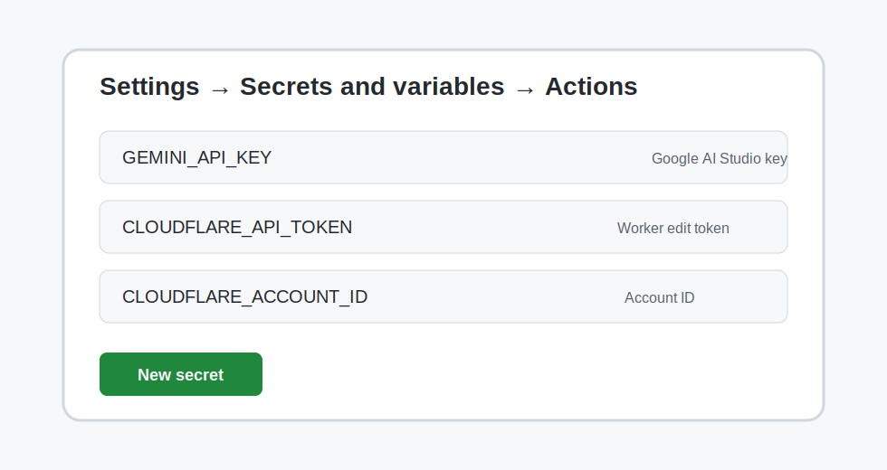
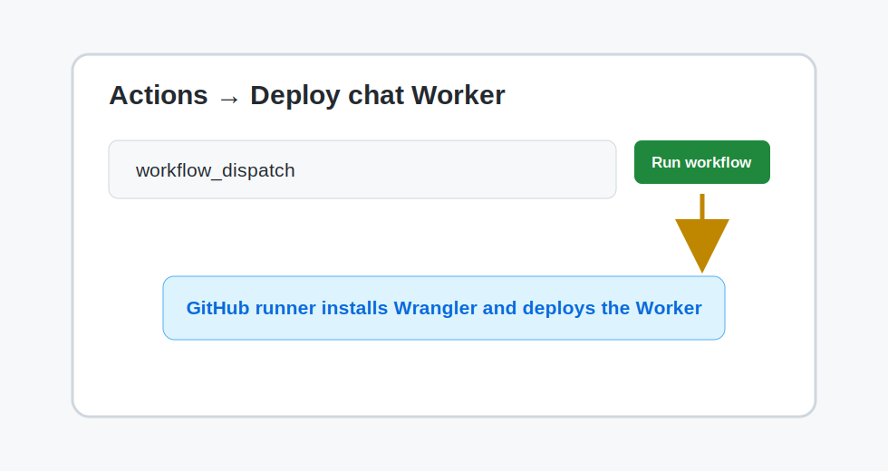
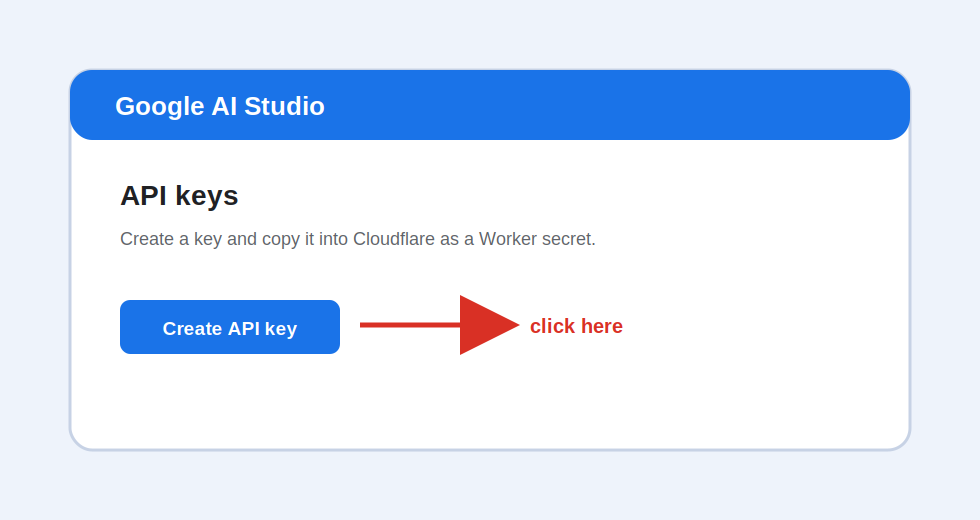
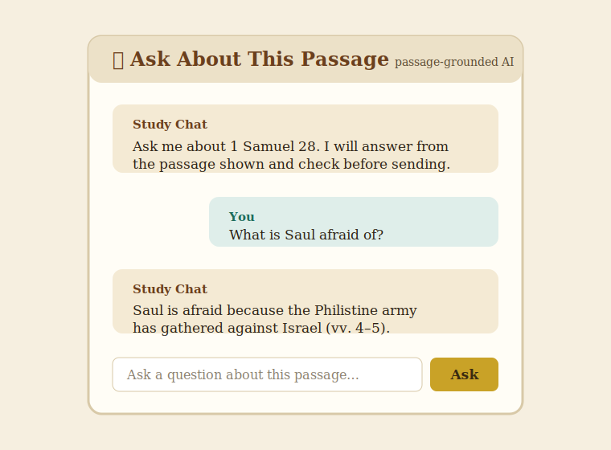

# Passage Study Chat Setup

The chat UI is already built into the app. To make it answer live questions, deploy the server-side AI proxy in `api/chat-worker.js`, add your Gemini API key as a secret, and point the static page at the Worker URL.

## What you are connecting



1. The browser gathers only the passage currently shown on the page.
2. The browser posts that context and the user question to your Worker.
3. The Worker calls Gemini with your secret API key.
4. Gemini returns JSON; the Worker sends the answer back to the chat panel.

## Step-by-step checklist

### Option A: deploy from GitHub Actions, no laptop install



Add these repository secrets in **GitHub → Settings → Secrets and variables → Actions**:

- `GEMINI_API_KEY`: your Google AI Studio key.
- `CLOUDFLARE_API_TOKEN`: a Cloudflare API token with Worker edit permissions.
- `CLOUDFLARE_ACCOUNT_ID`: your Cloudflare account ID.

Then open **Actions → Deploy chat Worker → Run workflow**. The workflow installs Wrangler on GitHub’s runner, stores the Gemini key as a Worker secret, and deploys the Worker.



### Option B: deploy from a cloud shell or Codex environment

If you do not want Wrangler on your laptop, export the secrets only inside the cloud shell and run:

```bash
export GEMINI_API_KEY="paste-your-google-key-here"
export CLOUDFLARE_API_TOKEN="paste-your-cloudflare-token-here"
export CLOUDFLARE_ACCOUNT_ID="paste-your-cloudflare-account-id-here"
./scripts/deploy-chat-worker.sh
```

Do not commit those `export` lines. They are only for the current shell session.

### Option C: deploy from your laptop

#### 1. Create a Gemini API key



1. Go to <https://aistudio.google.com/app/apikey>.
2. Click **Create API key**.
3. Copy the key. Keep it private; never paste it into `index.html` or any browser JavaScript file.

#### 2. Install and sign in to Wrangler

From the repository root, run:

```bash
npm install --save-dev wrangler
npx wrangler login
```

A browser window opens for Cloudflare authorization.

#### 3. Store the key as a Worker secret

```bash
npx wrangler secret put GEMINI_API_KEY
```

Paste the Gemini key when Wrangler prompts you.

#### 4. Deploy the Worker

```bash
npx wrangler deploy
```

Wrangler prints a URL like:

```text
https://bible-verse-visualizer-chat.<your-subdomain>.workers.dev
```

The chat endpoint is that URL itself, because `api/chat-worker.js` handles `POST /`.

### Point the static page at the Worker

Open `index.html` and set `window.BVV_CHAT_ENDPOINT` before `js/chat.js` loads:

```html
<script>
  window.BVV_CHAT_ENDPOINT = "https://bible-verse-visualizer-chat.<your-subdomain>.workers.dev";
</script>
<script src="js/chat.js"></script>
```

Commit and push that change to GitHub Pages.

### Test the live chat



1. Open the live site.
2. Load **1 Samuel 28**.
3. Ask: `What is Saul afraid of in this passage?`
4. You should receive a verse-grounded answer. If you see a setup message, confirm the endpoint URL and the Worker secret.

## Useful commands

```bash
# Run the static site locally
python3 -m http.server 8080

# Run the Worker locally after setting a local secret in .dev.vars
npx wrangler dev

# Deploy the Worker
npx wrangler deploy
```

## Troubleshooting

- **"Chat API key is not configured"**: run `npx wrangler secret put GEMINI_API_KEY`, then deploy again.
- **CORS or network error**: make sure `window.BVV_CHAT_ENDPOINT` exactly matches the Worker URL and uses `https://`.
- **404 from GitHub Pages `/api/chat`**: this is expected until you set `window.BVV_CHAT_ENDPOINT` to the Worker URL or route `/api/chat` through Cloudflare.
- **Provider rejected the request**: confirm the key is valid and `GEMINI_MODEL` names an available model.
